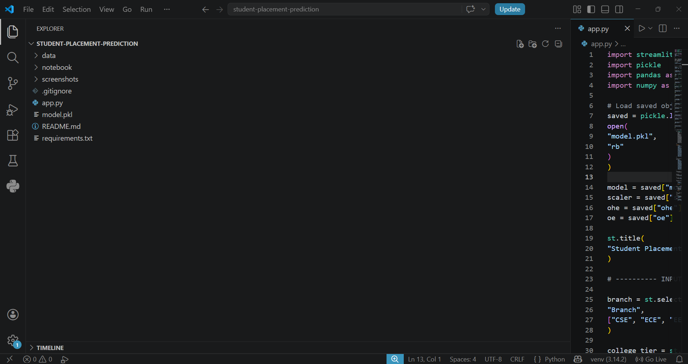
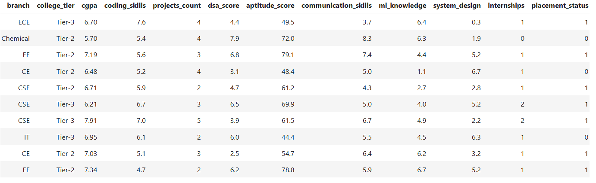
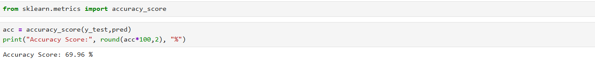
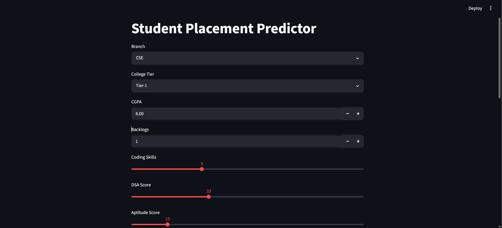
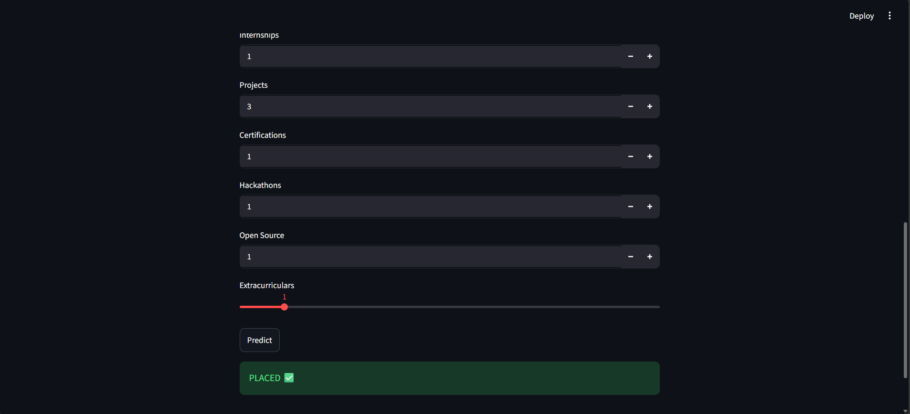

# Student Placement Prediction using Machine Learning

## Problem Statement

The objective of this project is to predict whether a student will get placed based on academic performance, technical skills, internships, certifications, and extracurricular activities.

This project helps analyze the factors that influence placements and provides prediction results using Machine Learning.

---

## Project Structure



---

## Dataset Preview



---

## Dataset Features

### Input Features

* branch
* college_tier
* cgpa
* backlogs
* coding_skills
* dsa_score
* aptitude_score
* communication_skills
* ml_knowledge
* system_design
* internships
* projects_count
* certifications
* hackathons
* open_source_contributions
* extracurriculars

### Target Variable

* placement_status

### Removed Column

* salary_package_lpa

---

## Technologies Used

* Python
* Pandas
* NumPy
* Scikit-learn
* Streamlit
* Jupyter Notebook

---

## Workflow

Dataset Collection
↓
Data Cleaning
↓
Train-Test Split
↓
Feature Scaling (StandardScaler)
↓
Encoding
• OneHotEncoder (branch)
• OrdinalEncoder (college_tier)
↓
Logistic Regression
↓
Model Evaluation
↓
Streamlit Deployment

---

## Model Used

**Logistic Regression**

---

## Model Performance

Accuracy Achieved: **69.96%**



---

## Application UI



---

## Prediction Example



---

## Future Improvements

Future versions may include:

* Hyperparameter tuning
* Cross Validation
* Random Forest
* Feature Engineering
* Improve model accuracy
* Add salary prediction
* Deploy on cloud
* Add authentication
* Build analytics dashboard

---

## Project Folder Structure

```text
student-placement-prediction/

├── data/
├── notebook/
├── screenshots/
│   ├── project_structure.png
│   ├── dataset_preview.png
│   ├── model_accuracy.png
│   ├── app_ui.png
│   └── prediction_result.png
│
├── .gitignore
├── app.py
├── model.pkl
├── requirements.txt
└── README.md
```

---

## How to Run

### Clone Repository

```bash
git clone <your-repository-url>
```

### Install Dependencies

```bash
pip install -r requirements.txt
```

### Run Application

```bash
streamlit run app.py
```

---

## Author

**V. Samba Shiva Reddy**

